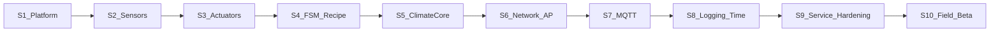

# Road map спринтов (подробная версия)

## Контекст

- Платформа разработки: **Arduino IDE** (ESP32 core), локально без `arduino-cli`.
- Спецификации и контракты уже описаны в `docs/architecture/`, `docs/api/`, `docs/recipes/`, `docs/ops/`.
- Рецепты — `recipes/*.yaml` с валидацией по `docs/recipes/recipe.schema.v1.json`.

## Спринт 1 — Каркас Arduino IDE и качество

**Цель:** воспроизводимая сборка и минимальный CI.

**Критерий готовности:**
- чистая сборка из чистого клона,
- CI зелёный,
- в UART логируется версия + git SHA,
- новый участник повторяет сборку по README.

### Атомарные задачи

**A. Платформа и структура**
1. Зафиксировать версию Arduino ESP32 core и версию Arduino IDE в `firmware/README.md` и `firmware/arduino-version.txt`.
2. Создать структуру `firmware/mushfarm/mushfarm.ino` + модульные `.h/.cpp`.
3. Зафиксировать целевую плату (`ESP32S3 Dev Module`) и важные board settings Arduino IDE в README (Flash mode/PSRAM/Partition scheme).
4. Проверить локальную сборку в Arduino IDE (`Verify`) и зафиксировать минимальный чеклист шагов.

**B. Build metadata**
5. Добавить лог project/version/compile-time в `setup()`.
6. Генерировать `build_info.h` с коротким SHA через простой pre-build скрипт (или на CI), не требуя `arduino-cli` локально.
7. Предусмотреть fallback `unknown`, если `.git` недоступен.

**C. CI**
8. Добавить `.github/workflows/firmware-build.yml` с автоматической сборкой Arduino-проекта (в CI можно использовать `arduino-cli` или готовый action).
9. Добавить кэш для core/библиотек.
10. Публиковать `*.bin`/`*.elf` артефакты.

**D. Документация/репо**
11. Обновить корневой `README.md` (ссылка на `firmware/README.md`).
12. Описать compile/upload/monitor в `firmware/README.md`.
13. Обновить `.gitignore` под Arduino артефакты.
14. Добавить `firmware/tools/build.ps1` или `build.sh`.

---

## Спринт 2 — Датчики (SCD41, MLX90614, вода)

**Цель:** стабильные измерения + stale-age + базовая классификация отказов.

**Задачи:**
- Wire/I2C обёртки и таймауты чтения,
- retry/debounce по `docs/architecture/fault-model.md`,
- обработка NaN/outlier,
- периодическое логирование stale-age.

**DoD:** валидные показания по UART; отключение датчика даёт ожидаемый fault.

---

## Спринт 3 — Приводы (PWM/реле)

**Цель:** безопасное управление fan/hum/light.

**Задачи:**
- единая абстракция `actuator_sink`,
- safe OFF на boot и при `EMERGENCY_STOP`,
- минимум anti-glitch/дребезг-устойчивости.

**DoD:** отсутствие самопроизвольных включений при старте/рестарте.

---

## Спринт 4 — FSM + рецепт

**Цель:** ядро жизненного цикла по `docs/architecture/state-machine.md`.

**Задачи:**
- диспетчер событий/переходов,
- выбор/валидация рецепта и snapshot `current_recipe`,
- сценарий `select -> start -> pause -> resume`.

**DoD:** сценарий выполняется локально без сети; состояния совпадают с контрактом.

---

## Спринт 5 — Климат и арбитраж

**Цель:** один рабочий замкнутый контур + safety hard limits.

**Задачи:**
- реализовать базовый RH или CO2 контур,
- hard limits из `docs/architecture/control-arbitration.md`,
- compact trace каждый тик + full trace по событию.

**DoD:** контур стабилизируется на стенде; emergency порог принудительно переопределяет команду.

---

## Спринт 6 — AP/HTTP

**Цель:** локальное управление по `docs/api/ap-contract.md`.

**Задачи:**
- SoftAP и базовая авторизация,
- `GET /api/v1/status`, `GET /api/v1/sensors/live`,
- базовые recipe endpoints (минимум list/upload/select).

**DoD:** подключение с телефона/ноута, получение статуса и загрузка рецепта в лимитах.

---

## Спринт 7 — MQTT

**Цель:** удалённое управление по `docs/api/mqtt-contract.md`.

**Задачи:**
- envelope/ack/alerts/telemetry,
- dedup LRU+TTL для `msg_id`,
- off-line очередь в RAM с bounded размером.

**DoD:** remote команды работают; повторный `msg_id` не дублирует side effects.

---

## Спринт 8 — Логи, SD, время

**Цель:** наблюдаемость и корректное время.

**Задачи:**
- ring buffer и flush на SD по `docs/ops/slo-and-alerting.md`,
- degrade policy при недоступной SD,
- NTP + `tz_offset_minutes` из `docs/architecture/threat-model-and-time.md`.

**DoD:** сутки непрерывной работы с валидной телеметрией и корректным light window.

---

## Спринт 9 — Service mode и hardening

**Цель:** безопасная эксплуатация и сервис.

**Задачи:**
- service actions + timeout rollback по `docs/architecture/service-mode-contract.md`,
- закрыть guards `next_stage`/`prev_stage` с `docs/recipes/transition-rules-v1.md`,
- TLS/секреты/anti-replay по `threat-model-and-time.md`.

**DoD:** сервисные операции не ломают safety инварианты; чеклист security закрыт.

---

## Спринт 10 — Полевое бета

**Цель:** стабилизация перед v1.

**Задачи:**
- soak/N-day прогон,
- фиксация известных ограничений,
- выпуск релиз-кандидата и beta checklist.

**DoD:** непрерывный прогон без критических сбоев; собран список инцидентов и решений.

---

## Сквозные правила

- Любое изменение поведения отражать в `docs/architecture/requirements-traceability.md`.
- Не двигать сеть/облако быстрее, чем стабилизирован локальный цикл датчики -> FSM -> приводы.
- Поддерживать совместимость рецептов по `docs/recipes/recipe-schema-v1.md`.
