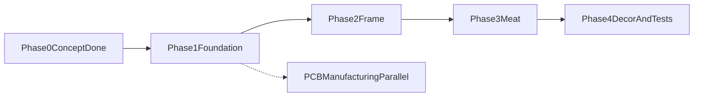

# Стресс-тест роадмапа от руководителя и переработанный план

> Аналитический документ. Актуальный единый roadmap: [roadmap.md](roadmap.md).

## Цель документа

Этот документ делает критический стресс-тест предложенного плана и фиксирует обновленный рабочий roadmap в формате **5 фаз (аналогия дома) × 10 спринтов**.

Базовые документы для истории (не заменяются):
- [roadmap-balanced.md](roadmap-balanced.md)
- [roadmap-detailed.md](roadmap-detailed.md)

## Что в речи руководителя верно

- Верная последовательность: сначала фундамент железа, потом архитектура, затем бизнес-логика и только потом polish.
- Идея отдельного self-check режима полезна для диагностики сборки и регрессий.
- Идея отдельного ручного сервисного контура через команды (serial/AP/MQTT) практична для стендовой отладки.
- Приоритет state-machine архитектуры до полной реализации бизнес-функций — корректный для embedded.
- Финальный стресс-тест в реальных условиях обязателен до beta.

## Критический разбор: где есть риски и логические ошибки

### 1) Self-check нельзя строить на быстром изменении RH

Утверждение "включили увлажнитель и сразу проверили рост влажности" ненадежно: отклик RH и прогрев сенсора не мгновенные. Это даст ложные падения теста.

Рекомендация:
- делить проверки на `AUTO_OK` и `NEEDS_OPERATOR`;
- в автомате проверять I2C доступность, диапазоны, GPIO, NVS round-trip, SD mount;
- визуальные/акустические проверки (свет, вентилятор, пар) подтверждать оператором.

Связанные документы:
- [architecture/fault-model.md](architecture/fault-model.md)
- [ops/slo-and-alerting.md](ops/slo-and-alerting.md)

### 2) Ручной сервисный контур без safety-ограничений опасен

Прямое ручное управление actuator-ами без ограничителей может повредить железо (например, увлажнитель при пустом баке).

Рекомендация:
- разделить команды на safe/bypass;
- сделать обязательный аварийный стоп высшего приоритета;
- все ручные команды запускать с timeout + автоматическим rollback.

Связанные документы:
- [architecture/service-mode-contract.md](architecture/service-mode-contract.md)
- [architecture/control-arbitration.md](architecture/control-arbitration.md)

### 3) "Голый скелет FSM" недостаточен

FSM-каркас должен включать не только переходы, но и guards, идемпотентность, аварийную защелку, действия входа/выхода, resume после power-loss.

Связанные документы:
- [architecture/state-machine.md](architecture/state-machine.md)
- [architecture/requirements-traceability.md](architecture/requirements-traceability.md)

### 4) Параллельное управление RH и CO2 требует кооперативного арбитража

Независимые контуры без ограничителей могут привести к конденсации, перерегулированию и нестабильности.

Рекомендация:
- использовать cooperative arbitration, hard limits и anti-oscillation как baseline, а не "опционально потом".

Связанные документы:
- [architecture/control-arbitration.md](architecture/control-arbitration.md)

### 5) Сеть, время и журналирование нельзя откладывать на "косметику"

AP/MQTT, NTP/TZ, ring-buffer/SD-flush — это часть эксплуатационной корректности, а не UI-polish.

Связанные документы:
- [api/ap-contract.md](api/ap-contract.md)
- [api/mqtt-contract.md](api/mqtt-contract.md)
- [architecture/threat-model-and-time.md](architecture/threat-model-and-time.md)
- [ops/slo-and-alerting.md](ops/slo-and-alerting.md)

### 6) Тестирование должно быть левее по timeline

Модульные и fault-injection проверки нужны по спринтам, не только в финале.

Связанные документы:
- [architecture/fault-model.md](architecture/fault-model.md)
- [BETA_CHECKLIST.md](BETA_CHECKLIST.md)

## Переработанный roadmap: 5 фаз × 10 спринтов

### Фаза 0 — Concept (уже выполнено)

- Зафиксированы BoM, схемы, базовые контракты и recipe-спецификация.

### Фаза 1 — Foundation (S1-S3)

- **S1:** инфраструктура сборки, версия core/libs, CI, воспроизводимость.
- **S2:** сенсоры и fault-классификация с retry/debounce.
- **S3:** приводы и безопасный старт/останов.

Добавляем подспринты:
- **S2.5 Self-check** (auto + operator-confirmed критерии).
- **S3.5 Service console** (serial команды для ручной отладки с safety guard).
- **S3.7 Power budget + PCB freeze gate**.

### Фаза 2 — Frame (S4)

- FSM-каркас по state-machine контракту:
  - состояния/события/guards;
  - idempotency;
  - emergency latch;
  - resume checkpoint.

### Фаза 3 — Meat (S5-S8)

- **S5:** климатический контур и арбитраж.
- **S6:** AP/HTTP управление.
- **S7:** MQTT команды/ack/dedup.
- **S8:** логи, SD, время (NTP/TZ), telemetry устойчивость.

### Фаза 4 — Decor and Tests (S9-S10)

- **S9:** service mode hardening + security.
- **S10:** soak/stress/chaos сценарии, beta стабилизация, фиксация ограничений.

Рекомендация: добавить OTA в S9-S10 как эксплуатационный must-have.

## Definition of Done по фазам

- **После фазы 1:** все компоненты читаются/управляются безопасно, нет самопроизвольных включений.
- **После фазы 2:** FSM корректно проходит ключевые переходы и аварийные ветки.
- **После фазы 3:** локальный и удаленный контур управления стабилен, логи и время корректны.
- **После фазы 4:** подтверждена полeвая надежность, собран список остаточных ограничений v1.

## Сквозные правила

- Любое изменение поведения синхронизировать с [architecture/requirements-traceability.md](architecture/requirements-traceability.md).
- Сеть не ускорять раньше стабилизации локального цикла датчики → FSM → приводы.
- Все команды управления (Serial/AP/MQTT) делать с защитой от повторов, таймаутами и rollback.
- Тесты, в том числе fault-injection, выполнять непрерывно по спринтам.

## Немедленные следующие шаги

1. Закрыть S2.5: self-check контракт и чек-лист.
2. Закрыть S3.5: сервисные команды с safety-ограничениями.
3. Закрыть S3.7: power budget замеры и freeze условий для PCB.
4. Перейти к задаче "построение архитектуры" (S4) на основе FSM контракта.
