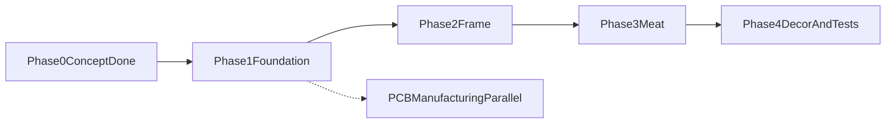

# Единый Roadmap проекта

Этот файл — единственный актуальный roadmap проекта.  
Подход: **5 фаз (аналогия дома) × 10 спринтов**.

## Логика движения

## Фазы и спринты

### Фаза 0 — Concept (выполнено)
- Зафиксированы BoM, базовые схемы и контракты.
- Базовые документы: `docs/architecture/`, `docs/api/`, `docs/recipes/`, `docs/ops/`.

### Фаза 1 — Foundation (S1-S3)

#### S1 — Платформа, сборка, CI
- **Цель:** воспроизводимая сборка в Arduino IDE и стабильный CI.
- **DoD:** чистая сборка из чистого клона, CI зеленый, в boot-логе есть версия + git SHA.
- **DoD (дополнительно):** зафиксирована OTA-совместимая partition scheme и выполнен ранний OTA smoke-test.
- **DoD (дополнительно):** добавлены метрики ресурсов (free heap, min free heap, largest free block, flash usage baseline).

#### S2 — Датчики и fault-модель
- **Цель:** стабильные чтения SCD41/MLX90614/XKC-Y25.
- **DoD:** retry/debounce/NaN handling работают, отключение датчика дает ожидаемый fault.

#### S3 — Приводы и safety на старте
- **Цель:** безопасное управление fan/hum/light.
- **DoD:** safe OFF при boot/reboot и при emergency, без самопроизвольных включений.

Подспринты фазы 1:
- **S2.5 Self-check:** разделение проверок на `AUTO_OK` и `NEEDS_OPERATOR`, обязательная индикация mock-режима.
- **S3.5 Service console:** ручные команды с safety-guard, аварийным стопом и timeout rollback.
- **S3.7 Power budget + PCB freeze gate:** замеры тока/нагрева и условия freeze перед разводкой платы.

### Фаза 2 — Frame (S4)

#### S4 — FSM + recipe runtime
- **Цель:** каркас жизненного цикла по `docs/architecture/state-machine.md`.
- **DoD:** корректные состояния/переходы/guards/idempotency, `select -> start -> pause -> resume`, resume checkpoint после power-loss.

### Фаза 3 — Meat (S5-S8)

#### S5 — Климат и арбитраж
- **Цель:** рабочий контур RH/CO2 с hard limits.
- **DoD:** контур стабилизируется на стенде, арбитраж соответствует `docs/architecture/control-arbitration.md`.
- **Фаза A (код):** модули `mf_loop_*`, `mf_climate_arbiter`, embedded profile — см. чеклист [s5-acceptance.md](dev/acceptance/s5-acceptance.md).
- **Фаза B (стенд):** PID tuning + soak 4–8 ч — после сборки hardware.

#### S6 — AP/HTTP
- **Цель:** локальное управление по `docs/api/ap-contract.md`.
- **DoD:** status/sensors/recipe endpoints работают с телефона/ноута.
- **DoD (дополнительно):** реализован и проверен сценарий `first-boot -> AP -> ввод/сохранение Wi-Fi credentials -> apply/reboot -> проверка подключения`.
- **Фаза A (код):** `mf_net_config`, `mf_wifi`, `mf_http_api` — см. [s6-acceptance.md](dev/acceptance/s6-acceptance.md).

#### S7 — MQTT
- **Цель:** удаленное управление по `docs/api/mqtt-contract.md`.
- **DoD:** ack + dedup `msg_id` + очередь offline без дублей side effects.
- **Фаза A (код):** `mf_mqtt`, `mf_mqtt_config`, `mf_cmd_dispatch`, `mf_msg_dedup` — см. [s7-acceptance.md](dev/acceptance/s7-acceptance.md).

#### S8 — Логи, SD, время
- **Цель:** наблюдаемость и корректное время.
- **DoD:** ring buffer + SD flush + degrade policy + NTP/TZ по `docs/architecture/threat-model-and-time.md`.
- **DoD (дополнительно):** SD flush реализован неблокирующим/порционным способом и не нарушает период цикла управления приводами.

Подспринты фазы 3:
- **S8.5 Camera — timelapse + service preview (cosmetic):**
  - **Назначение фичи:** камера в проекте — это **observability/UX**, а не control-input. Никакой логики управления (PID, safety, FSM-переходы) от неё не зависит. Задачи:
    1. собрать timelapse роста грибов за цикл (готовый видео-ассет к концу выращивания),
    2. показать low-FPS превью (~10 fps) в сервисном режиме для визуальной диагностики.
  - **Pre-requisite (done):** стаб `mf_camera` распознаёт hardware, `MF_CAMERA_ENABLE=0`, документация по FFC/DVP, BoM-строка, `WARN_CAMERA_FAIL` зафиксирован в FSM как sticky-флаг без переходов состояния.
  - **DoD (функция):** `MF_CAMERA_ENABLE=1`, успешный init + чтение sensor-id по SCCB; JPEG capture работает с разумным разрешением (например, VGA/SVGA); timelapse-фрейм пишется по recipe-defined интервалу **только в `ACTIVE_RUN`**; preview-stream ~10 fps доступен **только в SETUP_AP** через AP-эндпоинт.
  - **DoD (изоляция от control-плоскости):** capture никогда не блокирует tick FSM/PID (deadline-soft, дроп фрейма при превышении бюджета времени). Любой сбой камеры (NACK на SCCB, frame timeout, отвал FFC) → ставит `WARN_CAMERA_FAIL`, фича отключается, **FSM не двигается**.
  - **DoD (хранение, опционально):** если на момент S8.5 уже есть рабочий SD (см. S8) — timelapse-кадры пишутся туда с простой ротацией. Если SD недоступен — degrade до RAM ring buffer на последние N кадров без падения функции.
  - **DoD (ресурсы):** при включённой камере baseline heap/largest-free-block из S1 остаётся в пределах бюджета. Если не помещается — снижаем разрешение/частоту до пределов бюджета.
  - **Out of scope (явно):** AI-анализ (плесень, рост), детекция объектов, использование кадров как обратной связи в управлении. Это рассматривается отдельным проектом, а не S8.5.

### Фаза 4 — Decor and Tests (S9-S10)

#### S9 — Service mode hardening + security
- **Цель:** безопасная эксплуатация сервиса.
- **DoD:** service actions не ломают safety-инварианты, закрыты TLS/anti-replay требования.

#### S10 — Полевое бета
- **Цель:** финальная стабилизация перед v1.
- **DoD:** soak/stress/chaos сценарии пройдены, известные ограничения зафиксированы, готов release candidate.

## Что важно по стресс-тесту плана

- Self-check не должен опираться на мгновенный рост RH после включения увлажнителя.
- Ручное управление должно оставаться в safety-контуре (не "сырой bypass" по умолчанию).
- FSM-каркас включает guards/idempotency/emergency latch, а не только переходы.
- AP/MQTT/NTP/logging — эксплуатационное ядро, а не поздний "декор".
- Тестирование делается по спринтам, а не только в финале.

## Сквозные правила

- Любое изменение поведения отражать в `docs/architecture/requirements-traceability.md`.
- Не ускорять сеть/облако раньше стабилизации локального цикла `датчики -> FSM -> приводы`.
- Команды управления (Serial/AP/MQTT) должны иметь защиту от повторов, timeout и rollback.
- Fault-injection и регрессионные проверки выполнять постоянно, начиная с ранних спринтов.
- Мониторинг ресурсов памяти вести с ранних этапов: фиксировать free/min heap, фрагментацию (largest block) и динамику потребления после включения сети, FSM, логгера и JSON.

## Оценка сроков

- Один разработчик: ориентир 5-6 месяцев до стабильного MVP/beta.
- Сокращение сроков возможно за счет параллельной работы (железо/сеть/тестирование).
