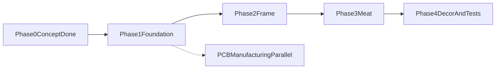

# Единый Roadmap проекта

Этот файл — единственный актуальный roadmap проекта.  
Подход: **5 фаз (аналогия дома) × 10 спринтов**.

## Логика движения

## Фазы и спринты

### Фаза 0 — Concept (выполнено)
- Зафиксированы BoM, базовые схемы и контракты.
- Базовые документы: `docs/architecture/`, `docs/api/`, `docs/recipes/`, `docs/ops/`.

### Фаза 1 — Foundation (S1-S3)

#### S1 — Платформа, сборка, CI
- **Цель:** воспроизводимая сборка в Arduino IDE и стабильный CI.
- **DoD:** чистая сборка из чистого клона, CI зеленый, в boot-логе есть версия + git SHA.

#### S2 — Датчики и fault-модель
- **Цель:** стабильные чтения SCD41/MLX90614/XKC-Y25.
- **DoD:** retry/debounce/NaN handling работают, отключение датчика дает ожидаемый fault.

#### S3 — Приводы и safety на старте
- **Цель:** безопасное управление fan/hum/light.
- **DoD:** safe OFF при boot/reboot и при emergency, без самопроизвольных включений.

Подспринты фазы 1:
- **S2.5 Self-check:** разделение проверок на `AUTO_OK` и `NEEDS_OPERATOR`, обязательная индикация mock-режима.
- **S3.5 Service console:** ручные команды с safety-guard, аварийным стопом и timeout rollback.
- **S3.7 Power budget + PCB freeze gate:** замеры тока/нагрева и условия freeze перед разводкой платы.

### Фаза 2 — Frame (S4)

#### S4 — FSM + recipe runtime
- **Цель:** каркас жизненного цикла по `docs/architecture/state-machine.md`.
- **DoD:** корректные состояния/переходы/guards/idempotency, `select -> start -> pause -> resume`, resume checkpoint после power-loss.

### Фаза 3 — Meat (S5-S8)

#### S5 — Климат и арбитраж
- **Цель:** рабочий контур RH/CO2 с hard limits.
- **DoD:** контур стабилизируется на стенде, арбитраж соответствует `docs/architecture/control-arbitration.md`.

#### S6 — AP/HTTP
- **Цель:** локальное управление по `docs/api/ap-contract.md`.
- **DoD:** status/sensors/recipe endpoints работают с телефона/ноута.

#### S7 — MQTT
- **Цель:** удаленное управление по `docs/api/mqtt-contract.md`.
- **DoD:** ack + dedup `msg_id` + очередь offline без дублей side effects.

#### S8 — Логи, SD, время
- **Цель:** наблюдаемость и корректное время.
- **DoD:** ring buffer + SD flush + degrade policy + NTP/TZ по `docs/architecture/threat-model-and-time.md`.

### Фаза 4 — Decor and Tests (S9-S10)

#### S9 — Service mode hardening + security
- **Цель:** безопасная эксплуатация сервиса.
- **DoD:** service actions не ломают safety-инварианты, закрыты TLS/anti-replay требования.

#### S10 — Полевое бета
- **Цель:** финальная стабилизация перед v1.
- **DoD:** soak/stress/chaos сценарии пройдены, известные ограничения зафиксированы, готов release candidate.

## Что важно по стресс-тесту плана

- Self-check не должен опираться на мгновенный рост RH после включения увлажнителя.
- Ручное управление должно оставаться в safety-контуре (не "сырой bypass" по умолчанию).
- FSM-каркас включает guards/idempotency/emergency latch, а не только переходы.
- AP/MQTT/NTP/logging — эксплуатационное ядро, а не поздний "декор".
- Тестирование делается по спринтам, а не только в финале.

## Сквозные правила

- Любое изменение поведения отражать в `docs/architecture/requirements-traceability.md`.
- Не ускорять сеть/облако раньше стабилизации локального цикла `датчики -> FSM -> приводы`.
- Команды управления (Serial/AP/MQTT) должны иметь защиту от повторов, timeout и rollback.
- Fault-injection и регрессионные проверки выполнять постоянно, начиная с ранних спринтов.

## Оценка сроков

- Один разработчик: ориентир 5-6 месяцев до стабильного MVP/beta.
- Сокращение сроков возможно за счет параллельной работы (железо/сеть/тестирование).
